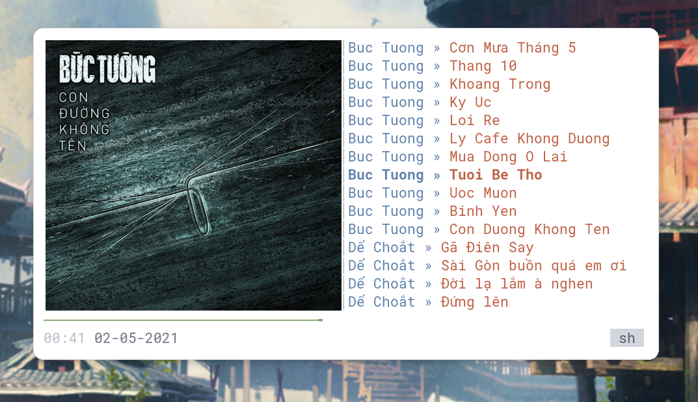

# ncmpcpp config

First, use `mpd.conf` to config your MPD.

Then clone this repo to `~/.ncmpcpp`.

Please note that MPD will run at port 6677. If you change the port, you need to replace all the occurence of this port in the repo.

